# 🌐 Inter-VLAN Routing with DHCP Relay using Cisco Packet Tracer

## 📖 Project Overview

This project demonstrates the implementation of **Inter-VLAN Routing** using the **Router-on-a-Stick** method in Cisco Packet Tracer. Multiple VLANs are configured on a Layer 2 switch, and a Cisco 2911 router provides communication between VLANs using IEEE 802.1Q encapsulation.

A centralized DHCP Server dynamically assigns IP addresses to clients in different VLANs through the **DHCP Relay Agent (`ip helper-address`)** configured on the router.

---

# 🎯 Project Objectives

- Configure multiple VLANs on a Cisco switch.
- Configure Router-on-a-Stick for Inter-VLAN Routing.
- Configure IEEE 802.1Q trunking.
- Configure DHCP Relay (`ip helper-address`).
- Assign IP addresses dynamically from a centralized DHCP Server.
- Verify connectivity between different VLANs.

---

# 🚀 Features

- ✅ Router-on-a-Stick
- ✅ Inter-VLAN Routing
- ✅ IEEE 802.1Q Trunking
- ✅ DHCP Relay Agent
- ✅ Centralized DHCP Server
- ✅ Dynamic IP Address Assignment
- ✅ Successful End-to-End Connectivity Testing

---

# 🛠 Technologies Used

- Cisco Packet Tracer
- Cisco 2911 Router
- Cisco Catalyst 2960 Switch
- DHCP Server
- IPv4 Addressing
- VLAN Configuration
- IEEE 802.1Q

---

# 📂 Repository Structure

```text
inter-vlan-routing-dhcp-relay-cisco
│
├── PacketTracer
│   └── vlan.pkt
│
├── screenshots
│   ├── topology.png
│   ├── DHCP-config.png
│   ├── switch-vlan.png
│   ├── switch-trunk.png
│   ├── switch-mac.png
│   ├── router-ip-route.png
│   ├── router-arp.png
│   ├── router-interface-brief.png
│   ├── router-ip-helper.png
│   ├── server-ip.png
│   ├── pc1-ip.png
│   ├── pc2-ip.png
│   ├── pc3-ip.png
│   ├── pc4-ip.png
│   ├── pc1-ping.png
│   └── pc4-ping.png
│
├── Configurations
├── Documentation
├── LICENSE
└── README.md
```

---

# 🖥 Network Topology

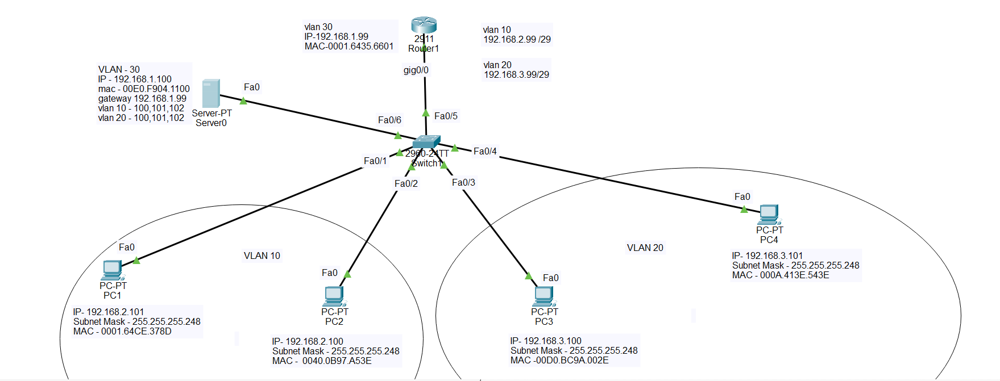

---

# 🔀 VLAN Configuration

The switch is configured with multiple VLANs to separate network traffic.

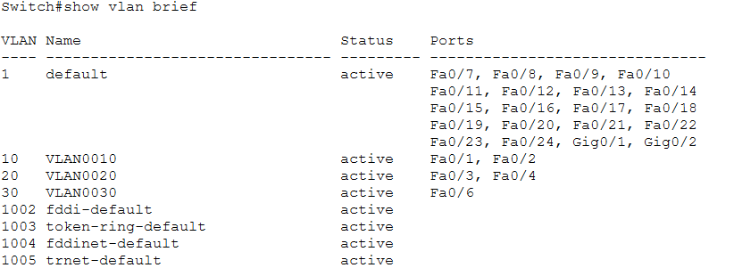

---

# 🔌 Trunk Configuration

The connection between the switch and router is configured as an IEEE 802.1Q trunk.

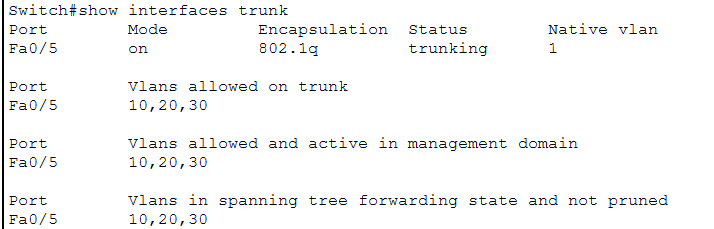

---

# 📡 MAC Address Table

The switch learns MAC addresses dynamically and forwards frames accordingly.

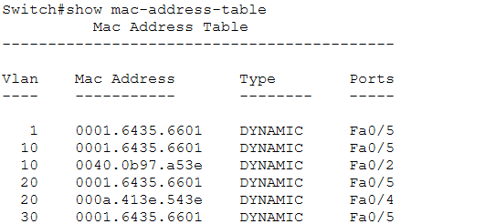

---

# 🌐 Router Configuration

The Cisco 2911 router performs Inter-VLAN Routing using subinterfaces.

### Routing Table


### Interface Status


### ARP Table

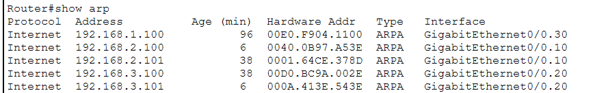

### DHCP Relay Configuration

The router forwards DHCP broadcast requests to the centralized DHCP server using `ip helper-address`.

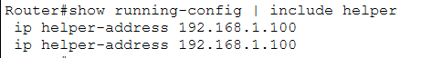

---

# 🖥 DHCP Server Configuration

A centralized DHCP Server dynamically allocates IP addresses to all VLANs.

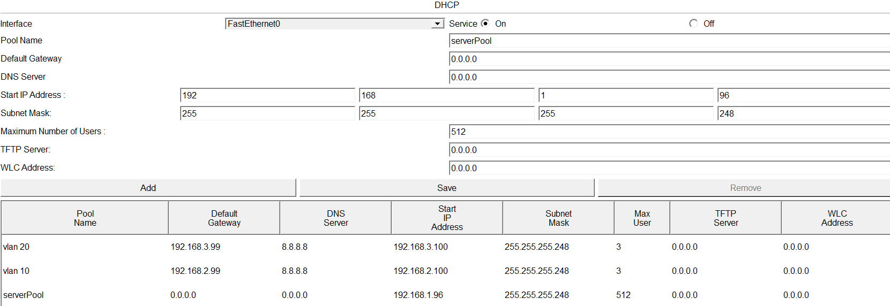

---

# 💻 Client IP Address Verification

### Server

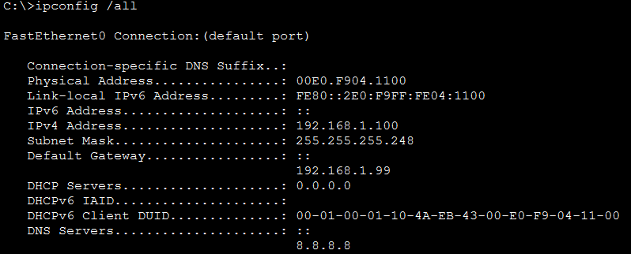

### PC1


### PC2

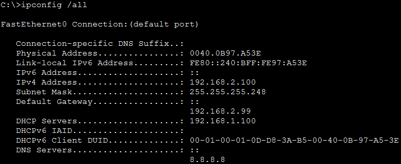

### PC3

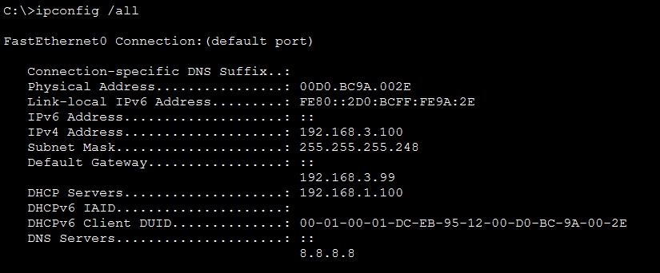

### PC4

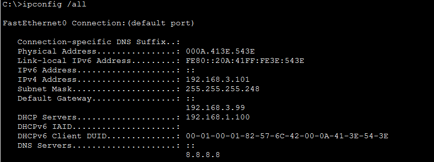

---

# ✅ Connectivity Test

Successful communication between different VLANs confirms that Inter-VLAN Routing is functioning correctly.

### PC1 → VLAN20


### PC4 → VLAN10


---

# 📚 Networking Concepts Covered

- VLAN Configuration
- Router-on-a-Stick
- IEEE 802.1Q Trunking
- DHCP Relay Agent
- Dynamic IP Address Assignment
- Routing Table Verification
- ARP Table Verification
- MAC Address Learning
- End-to-End Connectivity Testing

---

# 🎓 Learning Outcomes

After completing this project, you will understand:

- VLAN implementation
- Inter-VLAN Routing
- DHCP Relay configuration
- Router subinterfaces
- Trunk link configuration
- Dynamic IP allocation
- Basic enterprise network design
- Cisco CLI verification commands

---

# 🔍 Verification Commands

### Router

```bash
show ip route
show arp
show ip interface brief
show running-config
```

### Switch

```bash
show vlan brief
show interfaces trunk
show mac address-table
```

---

# 👩‍💻 Author

**Sowjanya Peeka**

- MCA Graduate (2023)
- Networking Enthusiast
- Cisco Packet Tracer Projects
- Learning CCNA & Enterprise Networking

---

## ⭐ If you found this project useful, consider giving it a star on GitHub!
